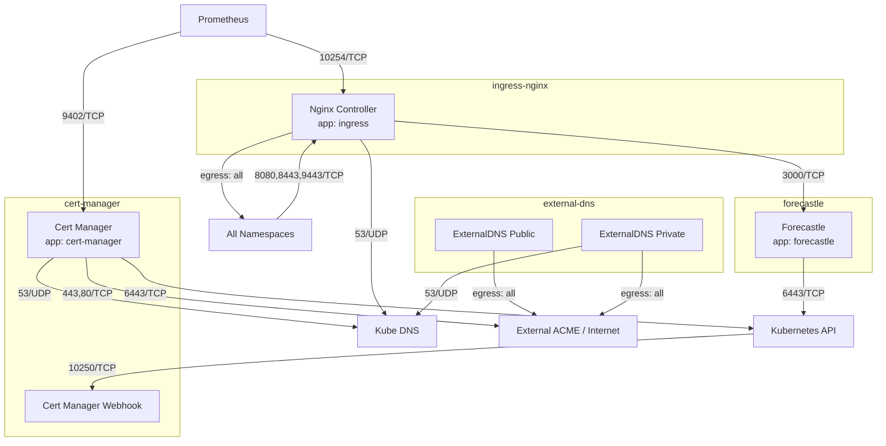

# Dual Nginx Configuration

```mermaid
graph TD
    %% Namespaces
    subgraph ingress-nginx
        nginx[Nginx Controller<br/>app: ingress]
    end

    subgraph cert-manager
        cm[Cert Manager<br/>app: cert-manager]
        cmw[Cert Manager Webhook]
    end

    subgraph forecastle
        fc[Forecastle<br/>app: forecastle]
    end

    subgraph external-dns
        ednsPub[ExternalDNS Public]
        ednsPriv[ExternalDNS Private]
    end

    %% External and K8s Core Components
    dns[Kube DNS]
    api[Kubernetes API]
    prom[Prometheus]
    ext[External ACME / Internet]

    %% Edges
    nginx & cm & ednsPriv -->|"53/UDP"| dns
    cm -->|"6443/TCP"| api
    fc -->|"6443/TCP"| api
    api -->|"10250/TCP"| cmw
    prom -->|"10254/TCP"| nginx
    prom -->|"9402/TCP"| cm
    cm -->|"443,80/TCP"| ext
    all[All Namespaces] -->|"8080,8443,9443/TCP"| nginx
    nginx -->|"egress: all"| all
    nginx -->|"3000/TCP"| fc
    ednsPub & ednsPriv -->|"egress: all"| ext
```

> Note: when HAProxy is enabled the same flows apply in the `ingress-haproxy` namespace with ports `6060/8080/8443/1024`.
