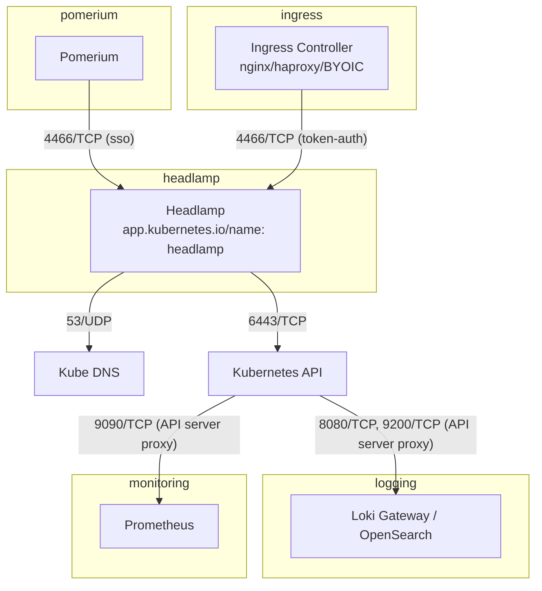

# Headlamp Configuration

```mermaid
graph TD
    %% Namespaces
    subgraph headlamp
        hl[Headlamp<br/>app.kubernetes.io/name: headlamp]
    end

    subgraph pomerium
        pom[Pomerium]
    end

    subgraph ingress
        ing[Ingress Controller<br/>nginx/haproxy/BYOIC]
    end

    subgraph logging
        logs[Loki Gateway / OpenSearch]
    end

    subgraph monitoring
        prom[Prometheus]
    end

    %% K8s Core Components
    dns[Kube DNS]
    api[Kubernetes API]

    %% Edges
    hl -->|"53/UDP"| dns
    hl -->|"6443/TCP"| api
    pom -->|"4466/TCP (sso)"| hl
    ing -->|"4466/TCP (token-auth)"| hl
    api -->|"9090/TCP (API server proxy)"| prom
    api -->|"8080/TCP, 9200/TCP (API server proxy)"| logs
```
