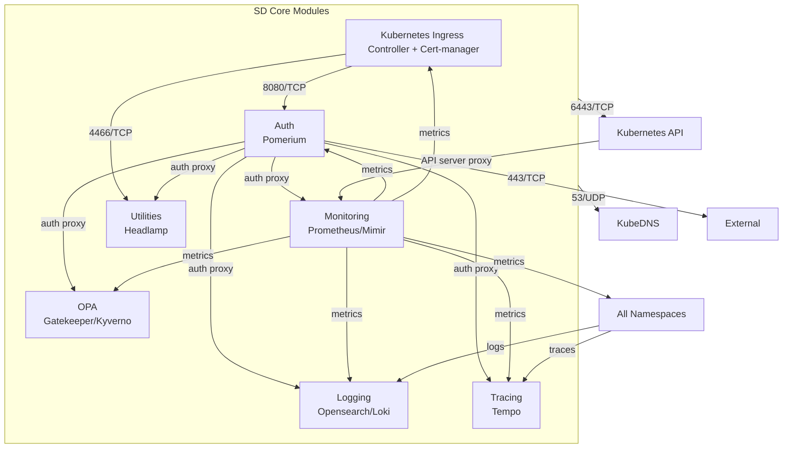

# SD Network Policies Overview

```mermaid
graph TD
    subgraph kfd[SD Core Modules]
        ingress[Kubernetes Ingress Controller + Cert-manager]
        auth[Auth<br/>Pomerium]
        mon[Monitoring<br/>Prometheus/Mimir]
        log[Logging<br/>Opensearch/Loki]
        tracing[Tracing<br/>Tempo]
        opa[OPA<br/>Gatekeeper/Kyverno]
        util[Utilities<br/>Headlamp]
    end

    %% K8s Core Components
    dns[KubeDNS]
    api[Kubernetes API]
    ext[External]

    %% Edges
    kfd --->|"53/UDP"| dns
    kfd -->|"6443/TCP"| api
    ingress -->|"8080/TCP"| auth
    ingress -->|"4466/TCP"| util
    auth -->|"auth proxy"| mon & log & tracing & opa & util
    auth -->|"443/TCP"| ext
    mon -->|"metrics"| all
    mon -->|"metrics"| auth
    mon -->|"metrics"| ingress
    mon -->|"metrics"| log
    mon -->|"metrics"| tracing
    mon -->|"metrics"| opa
    api -->|"API server proxy"| mon
    all[All Namespaces] -->|"logs"| log
    all -->|"traces"| tracing


```